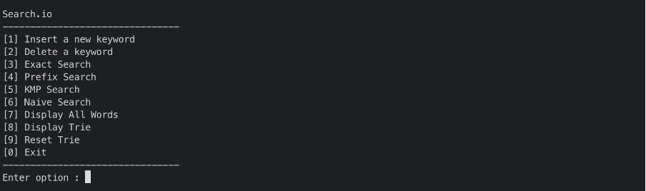
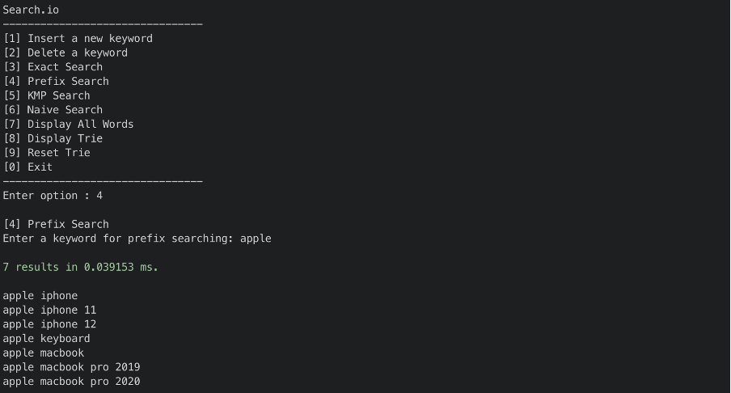
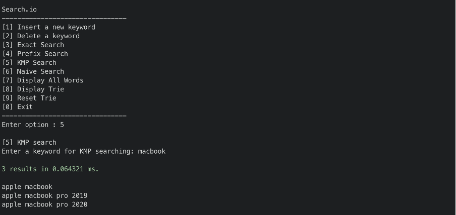
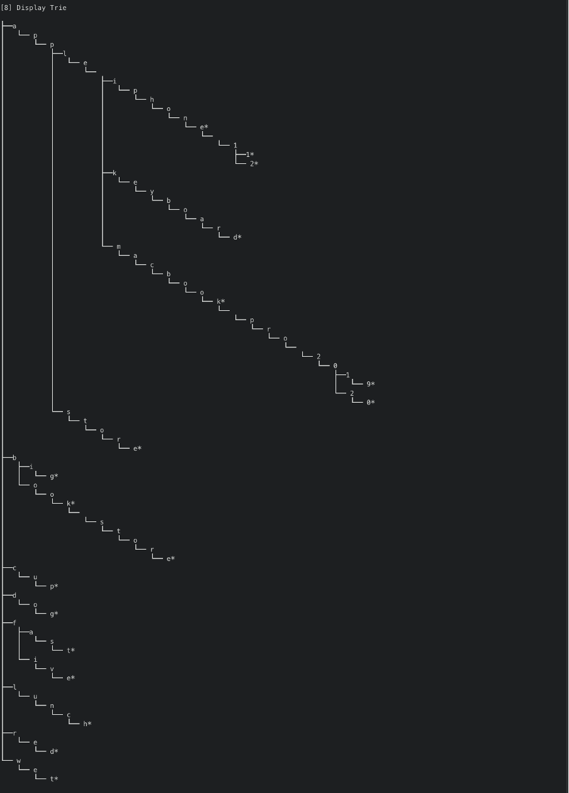

# Search.io
The application is a little search engine implemented in Trie Data Structure. The key feature of the application is to provide recommendations to auto-complete the query when the user types in a prefix of his query. The user can also retrieve the definition when he searches for a keyword which exists in the search engine’s dictionary. Other than that, the application demonstrates different types of searching algorithms which are KMP and naive searching.

# Screenshots
 
<p align="row">
  <h3>Menu</h3>
  
  <h3>Prefix Search</h3>
  
  <h3>KMP Search</h3>
  
  <h3>Display Trie</h3>
  
</p>

# How to run (using g++)

## How to run (Linux)
```
cd src
g++ --std=c++17 main.cpp -o run
./run
```

## How to run (Windows)
- Compile the file `src/main.cpp` in windows to produce the executable and then run the executable.
